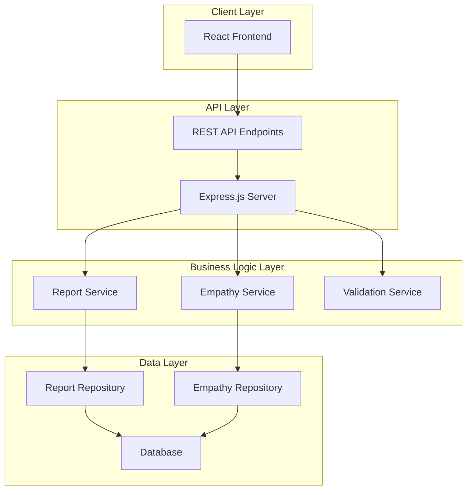
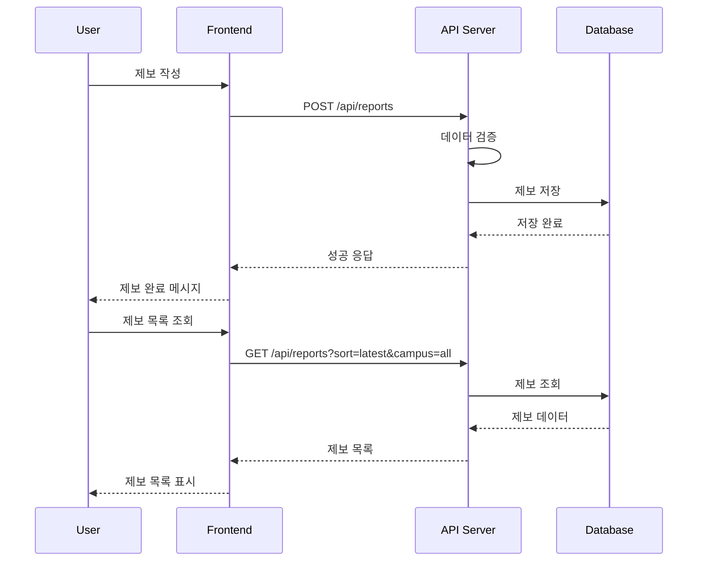

# Design Document

## Overview

인제대학교 와이파이 문제 제보 시스템은 학생들이 캠퍼스 내 와이파이 문제를 신고하고 공유할 수 있는 웹 애플리케이션입니다. 시스템은 사용자 친화적인 인터페이스를 통해 문제 제보, 조회, 공감 기능을 제공하며, 관리자가 문제 발생 지역의 우선순위를 파악할 수 있도록 돕습니다.

### 기술 스택
- **Frontend**: React.js with TypeScript
- **Backend**: Node.js with Express.js
- **Database**: SQLite (개발 단계), PostgreSQL (운영 단계)
- **Styling**: Tailwind CSS
- **State Management**: React Context API
- **HTTP Client**: Axios

## Architecture

### 시스템 아키텍처



### 데이터 흐름



## Components and Interfaces

### Frontend 컴포넌트 구조

```
src/
├── components/
│   ├── common/
│   │   ├── Header.tsx
│   │   ├── Footer.tsx
│   │   └── LoadingSpinner.tsx
│   ├── report/
│   │   ├── ReportForm.tsx
│   │   ├── ReportList.tsx
│   │   ├── ReportCard.tsx
│   │   ├── ReportDetail.tsx
│   │   └── ReportFilters.tsx
│   └── empathy/
│       └── EmpathyButton.tsx
├── pages/
│   ├── HomePage.tsx
│   ├── ReportFormPage.tsx
│   ├── ReportListPage.tsx
│   └── ReportDetailPage.tsx
├── services/
│   ├── api.ts
│   ├── reportService.ts
│   └── empathyService.ts
├── types/
│   └── index.ts
└── utils/
    └── validation.ts
```

### API 엔드포인트

#### 제보 관련 API
- `POST /api/reports` - 새 제보 생성
- `GET /api/reports` - 제보 목록 조회 (정렬, 필터링 지원)
- `GET /api/reports/:id` - 특정 제보 상세 조회
- `PUT /api/reports/:id` - 제보 수정 (비밀번호 인증 필요)
- `DELETE /api/reports/:id` - 제보 삭제 (비밀번호 인증 필요)

#### 공감 관련 API
- `POST /api/reports/:id/empathy` - 공감 추가
- `GET /api/reports/:id/empathy/count` - 공감 수 조회
- `GET /api/reports/:id/empathy/check` - 사용자 공감 여부 확인

### 주요 컴포넌트 인터페이스

#### ReportForm 컴포넌트
```typescript
interface ReportFormProps {
  onSubmit: (report: CreateReportRequest) => void;
  isLoading: boolean;
  initialData?: Partial<Report>;
}

interface ReportFormState {
  campus: string;
  building: string;
  location: string;
  problemTypes: string[];
  customProblem: string;
  description: string;
  password: string;
  errors: ValidationErrors;
}
```

#### ReportList 컴포넌트
```typescript
interface ReportListProps {
  reports: Report[];
  sortBy: SortOption;
  filters: FilterOptions;
  onSortChange: (sort: SortOption) => void;
  onFilterChange: (filters: FilterOptions) => void;
  isLoading: boolean;
}

interface FilterOptions {
  campus: string;
  building: string;
}

type SortOption = 'latest' | 'empathy';
```

## Data Models

### Report 모델
```typescript
interface Report {
  id: string;
  campus: string;
  building: string;
  location: string;
  problemTypes: string[];
  customProblem?: string;
  description: string;
  passwordHash: string;
  empathyCount: number;
  createdAt: Date;
  updatedAt: Date;
}
```

### Empathy 모델
```typescript
interface Empathy {
  id: string;
  reportId: string;
  userIdentifier: string; // 쿠키 기반 식별자
  createdAt: Date;
}
```

### 데이터베이스 스키마

#### reports 테이블
```sql
CREATE TABLE reports (
  id VARCHAR(36) PRIMARY KEY,
  campus VARCHAR(50) NOT NULL,
  building VARCHAR(100) NOT NULL,
  location VARCHAR(200) NOT NULL,
  problem_types JSON NOT NULL,
  custom_problem VARCHAR(200),
  description TEXT NOT NULL,
  password_hash VARCHAR(255) NOT NULL,
  empathy_count INTEGER DEFAULT 0,
  created_at TIMESTAMP DEFAULT CURRENT_TIMESTAMP,
  updated_at TIMESTAMP DEFAULT CURRENT_TIMESTAMP ON UPDATE CURRENT_TIMESTAMP
);
```

#### empathies 테이블
```sql
CREATE TABLE empathies (
  id VARCHAR(36) PRIMARY KEY,
  report_id VARCHAR(36) NOT NULL,
  user_identifier VARCHAR(255) NOT NULL,
  created_at TIMESTAMP DEFAULT CURRENT_TIMESTAMP,
  FOREIGN KEY (report_id) REFERENCES reports(id) ON DELETE CASCADE,
  UNIQUE KEY unique_empathy (report_id, user_identifier)
);
```

## Error Handling

### Frontend 에러 처리
- **네트워크 에러**: 연결 실패 시 재시도 버튼과 함께 사용자 친화적 메시지 표시
- **검증 에러**: 실시간 폼 검증으로 사용자 입력 오류 즉시 표시
- **서버 에러**: 5xx 에러 시 일반적인 오류 메시지와 함께 새로고침 안내

### Backend 에러 처리
```typescript
interface ApiError {
  code: string;
  message: string;
  details?: any;
}

// 에러 응답 형식
{
  "success": false,
  "error": {
    "code": "VALIDATION_ERROR",
    "message": "입력 데이터가 올바르지 않습니다",
    "details": {
      "description": "최소 20자 이상 입력해주세요"
    }
  }
}
```

### 에러 코드 정의
- `VALIDATION_ERROR`: 입력 데이터 검증 실패
- `UNAUTHORIZED`: 비밀번호 불일치
- `NOT_FOUND`: 존재하지 않는 제보
- `DUPLICATE_EMPATHY`: 중복 공감 시도
- `SERVER_ERROR`: 서버 내부 오류

## Testing Strategy

### Frontend 테스트
- **Unit Tests**: Jest + React Testing Library
  - 컴포넌트 렌더링 테스트
  - 사용자 상호작용 테스트
  - 폼 검증 로직 테스트
- **Integration Tests**: 
  - API 호출 및 응답 처리 테스트
  - 라우팅 테스트
- **E2E Tests**: Cypress
  - 제보 작성 플로우 테스트
  - 제보 조회 및 필터링 테스트
  - 공감 기능 테스트

### Backend 테스트
- **Unit Tests**: Jest
  - 서비스 로직 테스트
  - 데이터 검증 테스트
  - 비밀번호 해싱 테스트
- **Integration Tests**:
  - API 엔드포인트 테스트
  - 데이터베이스 연동 테스트
- **Load Tests**: Artillery
  - 동시 사용자 처리 능력 테스트
  - API 응답 시간 테스트

### 테스트 커버리지 목표
- Frontend: 80% 이상
- Backend: 90% 이상
- E2E: 주요 사용자 플로우 100% 커버

### 테스트 데이터
- 개발/테스트 환경용 시드 데이터 생성
- 다양한 캠퍼스, 건물, 문제 유형 조합
- 공감 수가 다른 제보들로 정렬 테스트 지원